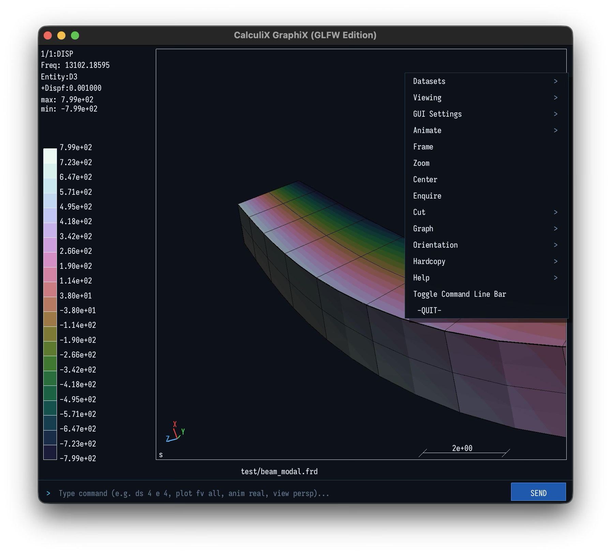

# CalculiX CrunchiX Multi-Solver Edition

An effort of solver backend modernization for [CalculiX CrunchiX](https://www.dhondt.de/), the open-source finite-element solver created by Dr. Guido Dhondt. The project preserves the original CalculiX numerical code with a more performant open- source options for solver backends, and multi-platform. Single codebase compiles in Linux, MacOS, and Windows.

<!-- [](https://github.com/carlomontec/CalculiX-CrunchiX-MultiSolver/actions/workflows/ci.yml) -->
[](COPYING)
[](#platform-support--roadmap)
[](#multi-solver-architecture)
[](#solver-benchmarks--verification-pass-rates)
[](#solver-benchmarks--verification-pass-rates)
[](#solver-benchmarks--verification-pass-rates)
[](#solver-benchmarks--verification-pass-rates)
[](#solver-benchmarks--verification-pass-rates)
[](#solver-benchmarks--verification-pass-rates)


## Table of Contents

- [Goal](#goal)
- [Project Status](#project-status)
- [Quick Installation](#quick-install-for-linux-macos-and-windows-recommended)
  - [Linux & macOS One-Liner](#quick-install-for-linux-macos-and-windows-recommended)
  - [Windows (PowerShell)](#quick-install-for-windows-powershell)
- [Companion Project: CalculiX GraphiX GLFW](#companion-project-calculix-graphix-glfw)
- [Solver Backends](#solver-backends)
  - [Linear Equation Solvers](#linear-equation-solvers)
  - [Eigenvalue Solver (arpack-ng)](#eigenvalue-solver-modal-analysis--buckling)
- [Quick Installation](#quick-install-for-linux-macos-and-windows-recommended)
  - [Linux & macOS One-Liner](#quick-install-for-linux-macos-and-windows-recommended)
  - [Windows (PowerShell)](#quick-install-for-windows-powershell)
- [Repository Guide](#repository-guide)
- [Attribution and License](#attribution-and-license)


## Goal

This work is a didactic exploration of agent-assisted scientific-software development by Carlo Monjaraz-Tec. Almost all the code that differ from the original CalculiX CrunchiX code is AI generated. The original CalculiX implementation and its authors remain credited below.

## Project Status

- **Multi-Solver Architecture**: Unified codebase supporting four sparse direct backends: **MUMPS 5.x** (recommended open-source default), **Apple Accelerate** (native macOS), **Intel oneMKL PARDISO** (Linux/Windows), and **SPOOLES 2.2** (legacy baseline).
- **Modern Eigenvalue Solver**: Integrated **`arpack-ng`** for `*FREQUENCY`, `*MODAL DYNAMIC`, and `*BUCKLE` analyses, replacing the legacy 1990s ARPACK 96 archive.
- **Direct JSON Export (`-j` / `--json`)**: In-memory JSON export for zero-parsing automation in Python, Julia, and MATLAB workflows (see [JSON_EXPORT.md](JSON_EXPORT.md)).
- **High Performance & Compatibility**: Delivers substantial speedups over SPOOLES while maintaining >95% pass rate across the official 630-deck verification suite.

## Companion Project: CalculiX GraphiX GLFW

This project is designed to work with [CalculiX GraphiX GLFW](https://github.com/carlomontec/CalculiX-GraphiX-GLFW), a modernized CalculiX pre/post-processor with modern 3D rendering and ParaView export support.

## Solver Backends

### Linear Equation Solvers

| Backend | Linux | macOS | Windows | Role |
|:---|:---:|:---:|:---:|:---|
| **MUMPS 5.x** | System package (recommended) | Vendored archive | System/MSYS2 package (recommended) | Primary modern open-source candidate |
| **Apple Accelerate** | No | Native framework (recommended) | No | macOS sparse solver |
| **Intel oneMKL PARDISO** | Optional | No | Optional | High-performance oneMKL backend |
| **SPOOLES 2.2** | System package | Vendored archive | System package when available | Legacy compatibility and comparison baseline |

On Apple Silicon macOS, MUMPS and SPOOLES are built from pinned source archives: [MUMPS vendor package](third_party/mumps/README.md),  [SPOOLES vendor package](third_party/spooles/README.md)

### Eigenvalue Solver (Modal Analysis & Buckling)

| Solver | Distribution | Platform Support | Role |
|:---|:---|:---:|:---|
| **arpack-ng** | System package (`arpack` / `libarpack2-dev`) | Linux, macOS, Windows | Maintained Arnoldi eigenvalue solver for modal dynamics, frequency, and buckling analysis. Replaces legacy ARPACK 96. |


## Quick install for Linux, MacOS and Windows (Recommended)

Run this snippet in the terminal:

```bash
/bin/bash -c "$(curl -fsSL https://raw.githubusercontent.com/carlomontec/CalculiX-CrunchiX-MultiSolver/main/install.sh)"
```
After installation, the `ccx` executable is ready to use from the directory you selected. If you accept the shell-configuration prompt, that directory is added to your `PATH` and the `CalculiX` alias is created as well. See [INSTALL.md](INSTALL.md) for more details in installation with different solvers.

#### Quick install for Windows (PowerShell)
For Windows users, use the automated PowerShell installer. It will automatically detect or install MSYS2 and the required MinGW-w64 toolchains. Open a standard **Windows PowerShell** prompt and paste this entire block:

```powershell
# 1. Download the script into memory (using the main branch)
$script = irm https://raw.githubusercontent.com/carlomontec/CalculiX-CrunchiX-MultiSolver/main/install.ps1

# 2. Save it to disk with forced UTF-8 encoding (prevents Windows parsing errors)
$script | Out-File -FilePath install.ps1 -Encoding utf8

# 3. Temporarily allow script execution for this session and run it
Set-ExecutionPolicy Bypass -Scope Process -Force
.\install.ps1
```

## Companion Project: CalculiX GraphiX GLFW


This project is designed to work with [CalculiX GraphiX GLFW](https://github.com/carlomontec/CalculiX-GraphiX-GLFW), a flavor of CalculiX GraphiX with modern 3D GLFW rendering library. It also runs in Linux, MacOs and Windows. Binaries available.

## Solver Backends

### Linear Equation Solvers

| Backend | Linux | macOS | Windows | Role |
|:---|:---:|:---:|:---:|:---|
| **MUMPS 5.x** | System package (**recommended**) | Vendored archive | System/MSYS2 (**recommended**) package | Primary modern open-source candidate |
| **Apple Accelerate** | No | Native framework (**recommended**) | No | macOS sparse solver |
| **Intel oneMKL PARDISO** | Optional | No | Optional | High-performance oneMKL backend |
| **SPOOLES 2.2** | System package | Vendored archive | System package when available | Legacy compatibility and comparison baseline |

On Apple Silicon macOS, MUMPS and SPOOLES are built from pinned source archives: [MUMPS vendor package](third_party/mumps/README.md),  [SPOOLES vendor package](third_party/spooles/README.md)

### Eigenvalue Solver (Modal Analysis & Buckling)

| Solver | Distribution | Platform Support | Role |
|:---|:---|:---:|:---|
| **arpack-ng** | System package (`arpack` / `libarpack2-dev`) | Linux, macOS, Windows | Maintained Arnoldi eigenvalue solver for modal dynamics, frequency, and buckling analysis. Replaces legacy ARPACK 96. |

## Repository Guide

- [INSTALL.md](INSTALL.md): prerequisites, automated installation, manual CMake builds, and troubleshooting.
- [VALIDATION.md](VALIDATION.md): official test-suite validation and result interpretation.
- [JSON_EXPORT.md](JSON_EXPORT.md): direct JSON export guide and schema reference for Python, Julia, and MATLAB workflows.
- [MODERNIZATION.md](MODERNIZATION.md): architecture and roadmap.
- [test_NewLib/run_official_testsuite.py](test_NewLib/run_official_testsuite.py): full correctness comparison runner.
- [test_NewLib/benchmark_solvers.py](test_NewLib/benchmark_solvers.py): focused performance benchmark.


## Attribution and License

CalculiX CrunchiX is free software distributed under the GNU General Public License version 2. The original project is maintained by Dr. Guido Dhondt. CalculiX GraphiX was created by Klaus Wittig.

- CalculiX: [calculix.de](https://www.calculix.de) and [dhondt.de](https://www.dhondt.de)
- CalculiX community: [CalculiX Discourse](https://calculix.discourse.group)
- Theory reference: G. Dhondt, *The Finite Element Method for Three-Dimensional Thermomechanical Applications*, Wiley, 2004.

Solver licensing is documented by each upstream project. The vendored MUMPS source is distributed under CeCILL-C; SPOOLES 2.2 is public domain; Intel oneMKL and Apple Accelerate remain subject to their respective upstream license agreements.
